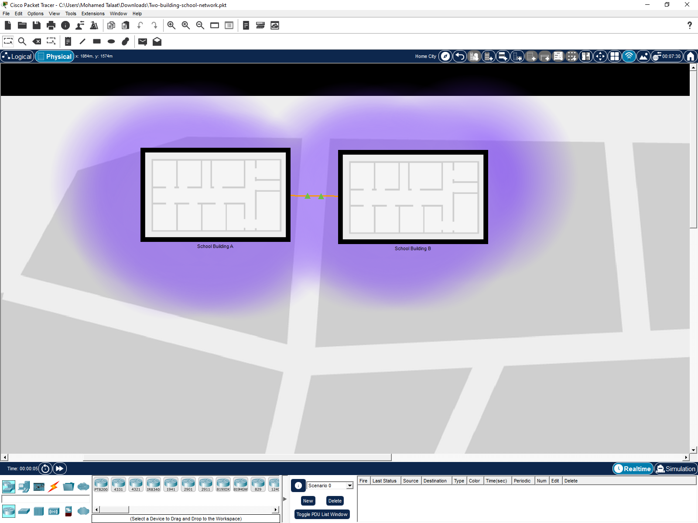
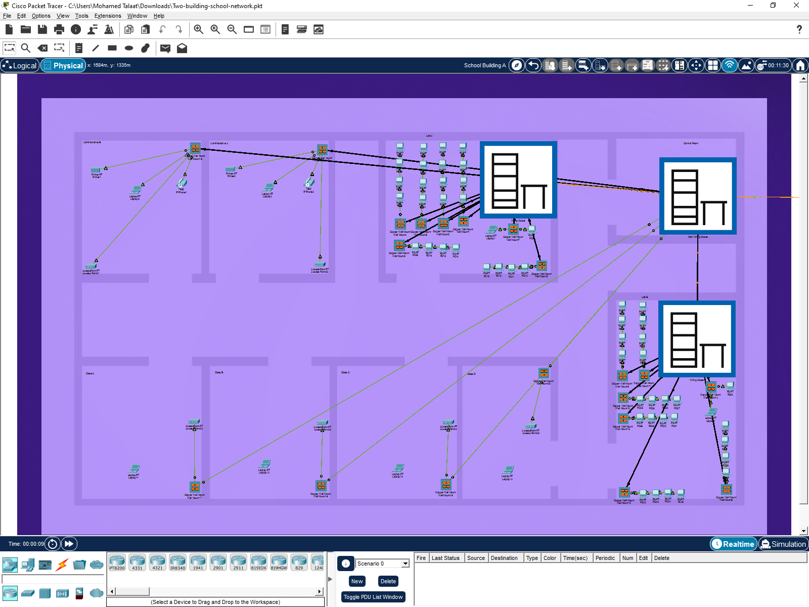
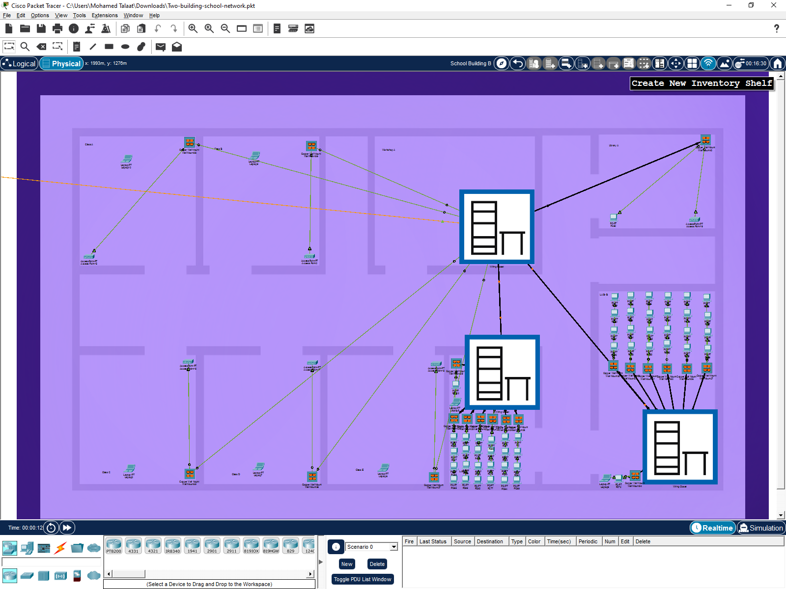

# 🏫 School Campus Network Infrastructure Design & Procurement

A production-ready enterprise network design and physical cabling layout engineered for a school campus consisting of two main buildings (**Building A** and **Building B**). This project bridges the gap between logical network simulation (Cisco Packet Tracer) and physical layer deployment (structured cabling schedules & hardware procurement budgets).

---

## 📁 Repository Structure

* 📄 **`Two-building-school-network.pkt`** — Cisco Packet Tracer topology file simulating logical segregation, routing, and access control.
* 📄 **`School-physical-cabling-plan.xlsx`** — Complete physical layer cabling schedule (ports, jacks, punchdown blocks, and patch panels for both buildings).
* 📄 **`Network-documentation-and-specs.pdf`** — Technical design report including VLAN addressing, Bill of Materials (BOM) cost estimation, and procurement contract.

---

## 🗺️ Physical Campus Topology & Wiring Layout

### 1. Overall Campus Layout (Building A & Building B)
The campus comprises two primary buildings interconnected via high-speed fiber uplink to ensure seamless communication and resource sharing:

---

### 2. Building A Internal Cabling & TR Layout
Dedicated physical cabling paths for **Lab A** mapped directly to the Telecommunication Rooms (TR) utilizing structured patch panels and wall mounts:

---

### 3. Building B Internal Cabling & Classrooms Layout
Detailed distribution mapping classrooms, labs, administration offices, and the library directly to the main wiring closets:

---

## 🛠️ Network Architecture & Specs

### Logical Layout & Subnetting (VLSM)
The network is segmented into **8 VLANs** to isolate administrative, student, and wireless traffic:

| VLAN ID | Subnet | Description | Type |
| :---: | :--- | :--- | :--- |
| **VLAN 10** | `10.10.10.0/24` | Admin | Wired |
| **VLAN 20** | `20.20.20.0/24` | Lab A1 | Wired |
| **VLAN 30** | `30.30.30.0/24` | Lab B1 | Wired |
| **VLAN 50** | `50.50.50.0/24` | Wi-Fi 1 | Wireless |
| **VLAN 60** | `60.60.60.0/24` | Lab A2 | Wired |
| **VLAN 70** | `70.70.70.0/24` | Lab B2 | Wired |
| **VLAN 80** | `80.80.80.0/24` | Wi-Fi 2 | Wireless |

---

### Bill of Materials (BOM) & Budgeting
Detailed hardware specifications and pricing compiled for deployment (Total Project Budget: **$40,000 USD**):

* **Core Routing/Switching:**
  * 6 x Cisco 3650-24PS Multilayer Switches ($1,000 each)
  * 4 x Cisco 2960 Layer 2 Switches ($400 each)
  * 2 x PT Empty Routers ($250 each)
* **Wireless Infrastructure:**
  * 12 x Access Point PT ($150 each)
  * 2 x WLC (Wireless LAN Controller) ($600 each)
* **End Devices & Servers:**
  * 85 x PCs ($250 each)
  * 11 x Laptops ($500 each)
  * 1 x Centralized File/DNS Server ($1,200)
* **Passive Infrastructure:**
  * 41 x Copper Wall Mounts ($15 each)
  * 10 x Copper Patch Panels ($50 each)
  * 7 x Cable Blocks (305m) ($156 each)

---

## 📝 Procurement & Contract (SLA)
The final phase of the documentation includes a legal and financial procurement framework (عقد توريد) outlining:
* **Initial Payment:** 25% upfront deposit.
* **Delivery Timeline:** Full deployment completed within **12 to 14 weeks**.
* **Warranty:** 12-month comprehensive hardware and installation warranty.
